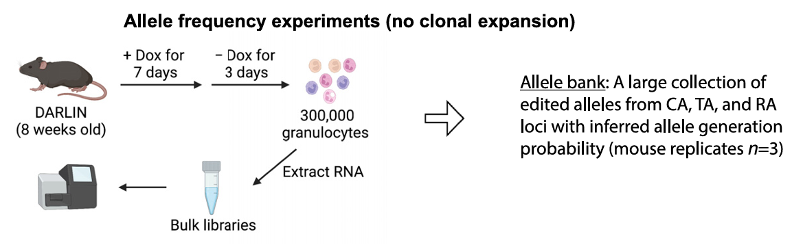

# Allele Bank



An **allele bank** is a reference collection of observed DARLIN alleles and their associated frequencies. It is used to identify reliable clones by filtering out homoplastic alleles, which can arise independently in multiple cells and therefore confound lineage interpretation.

This allele bank was generated from bulk RNA-seq libraries prepared for each of the three target arrays using 300,000 granulocytes from each of the three DARLIN mouse replicates. Libraries were collected shortly after Dox treatment, at day 3, so allele abundance primarily reflects the frequency at which alleles were generated rather than differential expansion among labeled clones.

## Reproducing the Allele Bank

Preprocess raw FASTQ files into `allele_by_umis_table` outputs:

```bash
./scripts/01.run_DARLIN_bulk_*.py
```

Generate the granulocyte allele bank:

```bash
./scripts/02.generating_allele_bank_Gr.ipynb
```

## Use the Allele Bank

### Contents

- **`allele`** — DARLIN allele identifier
- **`observed_count`** — Total UMIs supporting this allele, summed across all samples.
- **`sample_count`** — Number of samples the allele was observed.
- **`sample_id`** — Comma-separated sample identifiers.
- **`normalized_count`** — Proportion of total UMI.
- **`smoothed_homoplasy`** — Model-smoothed estimate between 0 and 1 of the probability that the allele is homoplastic at its observed abundance. It uses both **`observed_count`** (UMI-count bins) and **`sample_count`** (whether the allele was seen in more than one sample); alleles in the same bin are assigned the same fitted homoplasy probability (See Methods part of original DARLIN paper).

### How to choose homoplasy cutoff

Let $\rho$ denote the **barcode generation probability** (homoplasy probability) assigned to an observed barcode from the allele bank. In the manuscript, $\rho$ is the matched allele’s **`smoothed_homoplasy`** value. Let $\rho_*$ be the **homoplasy cutoff**: barcodes with $\rho > \rho_*$ are discarded.

In plain terms, the bound links how many clones you keep ($M$), your target false-discovery rate ($\alpha$), and how small the **average** homoplasy must be among retained barcodes, $\langle \rho \mid \rho \leq \rho_* \rangle$ (not the threshold $\rho_*$ by itself). For example, with $\alpha = 0.05$ and about $M = 100$ retained clones, $\frac{2\alpha}{M - 1} \approx 10^{-3}$, so in that regime the mean homoplasy among passing lineages should be about $10^{-3}$ or lower when you tune $\rho_*$ accordingly.

$$
\langle \rho \mid \rho \leq \rho_* \rangle \leq \frac{2\alpha}{M - 1},
$$

Full notation and motivation are in the original DARLIN paper (Methods).

In practice: 
1. We use **observed** homoplasy—whether the matched allele is seen in more than one bulk library (**`sample_count` > 1**)—rather than **`smoothed_homoplasy`** (the **inferred**, smoothed probability) when applying homoplasy cutoffs. 
2. We use `normalized_count` as a proxy to $\rho$.
